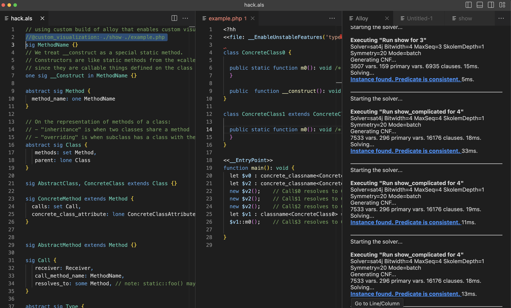
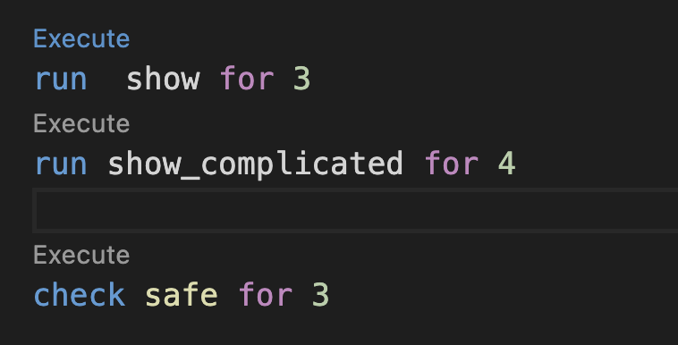
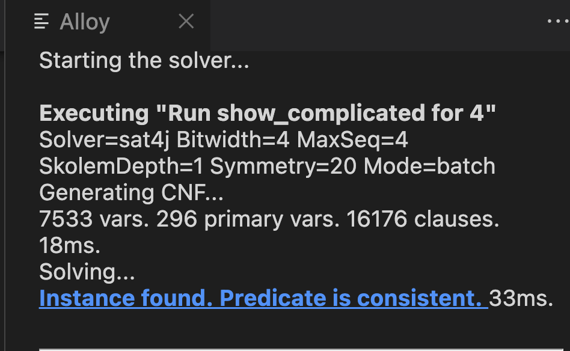
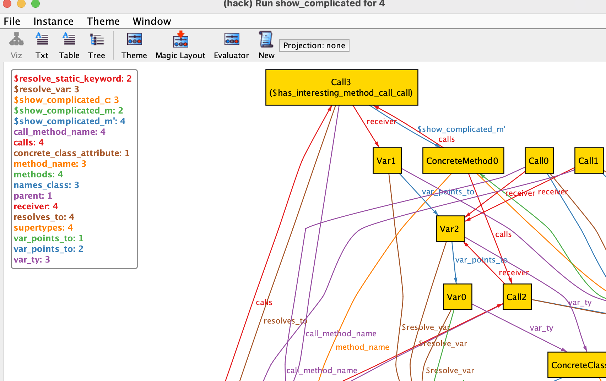

# Alloy VSCode with Custom Visualizations

All you need to run Alloy with custom visualizations.



Demo:

<video alt="demo" src="./demo.mov"></video>

## Installation

- Install [the Alloy VSCode Extension](https://marketplace.visualstudio.com/items?itemName=ArashSahebolamri.alloy)
- Replace its version of the Alloy jar with the one from https://github.com/mheiber/org.alloytools.alloy/releases/download/1/org.alloytools.alloy.dist.jar. On Mac you can do this with the following shell command:

```
curl -L https://github.com/mheiber/org.alloytools.alloy/releases/download/1/org.alloytools.alloy.dist.jar > ~/.VSCode/extensions/arashsahebolamri.alloy-0.7.1/org.alloytools.alloy.dist.jar
```

## Why?

For modelling a program language, I find the most helpful visualization is often generated code in the language, rather than a graph!

See below for how to generate valid [Hack](https://hacklang.org/) files.


## How to use

- You'll need an alloy file with some metadata and a custom visualizer. I recommend cloning https://github.com/mheiber/lsbsteak/ and opening the directory for that repo in VSCode.
- Then click the "Execute" tooltip above a `run` or `check` command. 



- If Alloy can find an example or counterexample, it will give you a link to an instance in the right pane. Click it.



- Your custom visualizer is called with the instance Alloy found. If you're using the example 'hack.als' mentioned above, this means there is now output in ./example.php: a valid Hack file generated by Alloy! It'll look something like this (excerpt):

```hack
<?hh
<<file: __EnableUnstableFeatures('typed_local_variables')>>

class ConcreteClass0 {

  public static function m0(): void /* ConcreteMethod$0*/ {
  }

  public  function __construct(): void /* ConcreteMethod$2*/ {}
}

// ellided ....
```

- You can now:
    - generate a new instance by re-clicking the link.
    - try changing the model and see if assertions are still valid
    - Use the Alloy Analyzer that is opened in the background (it has a Java icon). It'll show alternative visualizations, including table, text, and tree views:



If you want to create your own visualizations, here is the format of the metadata, in a comment in the Alloy file:

> The metadata looks like this: `//@custom_visualization: ./show ./example.php`. That says to call the program "./show" (relative path from the Alloy file) with arguments "./example.php" and the path to a file containing the Alloy example in flat tuples format.


## How to hack on this hack of a hack for Hack


This is a fork of [A fork of Alloy that adds a language server](https://github.com/s-arash/org.alloytools.alloy), see there for full instructions on how to build. The quick version is: `./gradlew build`.

For fast iteration, I run the following, which builds directly into the VSCode extension directory:

```sh
./gradlew build && rm -f ~/.vscode/extensions/arashsahebolamri.alloy-0.7.1/org.alloytools.alloy.dist.jar && cp org.alloytools.alloy.dist/target/org.alloytools.alloy.dist.jar ~/.vscode/extensions/arashsahebolamri.alloy-0.7.1/org.alloytools.alloy.dist.jar
```

Then I do CMD-Shift-P Reload in VSCode to pick up the new version of Alloy.

